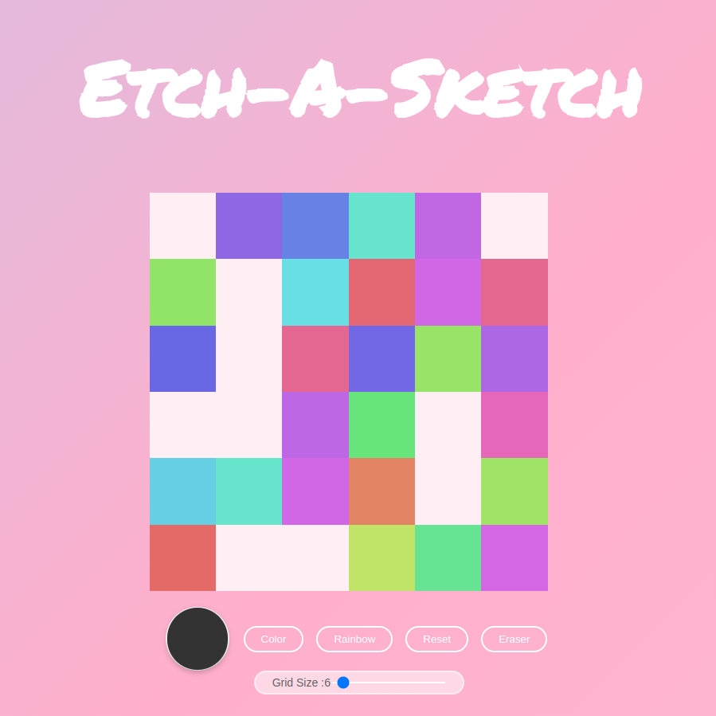

# Project: Etch-a-Sketch
 This project was completed as part of the curriculum for The Odin Project/

🔗 **Live preview** is [here](https://siemernj.github.io/etch-a-sketch/).

* Start off with rainbow painter, and smaller scale grid for fun visuals.
* Option to select color you want to paint with.
* Decrease the size of the brush (aka increase the grid size)

### My web toy in action: ###

